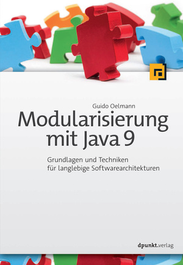

# Modularisierung mit Java 9 #

Willkommen zu den Beispielanwendungen aus dem Buch über die Modularisierung mit Java! 
In diesem Repository finden Sie die Quellcodes von allen Programmierbeispielen aus dem Buch.
Die Beispiele sind in verschiedenen, chronologisch angeordneten Unterverzeichnissen organisiert, so dass diese jeweils individuell ausgeführt und ausprobiert werden können. 

Viel Spaß beim Experimentieren und der Entwicklung von modularen Java-Anwendungen!

## Das Buch

**Modularisierung mit Java 9 - Grundlagen und Techniken für langlebige Softwarearchitekturen** 
Guido Oelmann 
[dpunkt.verlag](https://www.dpunkt.de/buecher/12659/9783864904776-modularisierung-mit-java-9.html), 2017 
[Amazon](https://www.amazon.de/Modularisierung-mit-Java-Grundlagen-Softwarearchitekturen/dp/3864904773) 
ISBN Print: 978-3-86490-477-6

## Die Beispiele

Jeder Ordner enthält Script-Dateien zum Bauen, Verpacken und Ausführen der jeweiligen Anwendung. Dies gilt auch für die Beispiele, die mit Build-Tool-Unterstützung wie z.B. Maven oder mit einer IDE erstellt wurden. Dadurch bleibt immer nachhvollziehbar, was für Schritte einschließlich der nötigen Java-Befehle notwendig sind, um den Bau der modularisierten Anwendungen durchzuführen. 

**Das Java-Modulsystem** 
* Kapitel 3.1 Das Modul: [1.1-OneModule](1.1-OneModule)  
* Kapitel 3.2 Abhängigkeiten und Sichtbarkeiten: [1.2-TwoModulesDep](1.2-TwoModulesDep)  
* Kapitel 3.2.2 Transitive Abhängigkeiten: [1.3-FourModulesTransDep](1.3-FourModulesTransDep) 
* Kapitel 3.3 Services: [2.1-ServiceProvider](2.1-ServiceProvider), [2.2-ServiceProviderAnnotations](2.2-ServiceProviderAnnotations)   
* Kapitel 3.4 Ressourcen: [3-Resources](3-Resources)   
* Kapitel 3.6 Reflection: [4-Reflection](4-Reflection)  
* Kapitel 3.7 Schichten und Klassenloader: [5-Layer](5-Layer)  

**Das modularisierte JDK** 
* Kapitel 4.4 Eigene modulare Laufzeit-Images: [6-EigenesRunTimeImage](6-EigenesRunTimeImage) 

**Testen und Patchen von Modulen** 
* Kapitel 5.2 Black-Box-Test: [7.1-Testen]7.1-Testen)  
* Kapitel 5.3 White-Box-Test: [7.1-Testen](7.1-Testen)  
* Kapitel 5.4 Patchen: [7.2-Patchen](7.2-Patchen)  

**Migration von Anwendungen** 
* Kapitel 6.4 - 6.6 Migration: [8-Migration](8-Migration) 

**Entwicklungswerkzeuge** 
* Kapitel 9.1.1 eclipse: [9.1-Eclipse](9.1-Eclipse), [9.2-Eclipse2Modules](9.2-Eclipse2Modules)
* Kapitel 9.1.2 NetBeans: [10-NetBeans](10-NetBeans) 
* Kapitel 9.1.3 IntelliJ: [11-IntelliJ](11-IntelliJ) 
* Kapitel 9.2.1 Ant: [12-Ant](12-Ant)  
* Kapitel 9.2.3 Maven und Eclipse: [13-MavenEclipse](13-MavenEclipse), [14-MavenEclipseWithDep](14-MavenEclipseWithDep) 

**Ein Real-World-Projekt** 
* Kapitel 10 Hotelbuchungssystem: [16-RealWorld](16-RealWorld)

**Weitere Modularisierungsansätze** 
* Kapitel 11.1 Microservices: [17-Microservice](17-Microservice)
* Kapitel 11.2 Container: [18-Docker](18-Docker) 

## Java-Befehle - Kurz & Knapp

Eine kleine Übersicht der wichtigsten Java-Befehle zum Bauen, Verpacken und Ausführen von modularisierten Java-Anwendungen:

1. Kompilieren der Module-Sourcen 
...`javac -d <Zielverzeichnis Class-Dateien> --module-source-path <Ort der Modul-Sourcen>`

2. Verpacken der Modul-Class-Dateien in JARs 
...`jar --create --file <Name JAR-Archiv> --main-class <Anwendungseinstiegspunkt> -C <Ort der Modul-Class-Dateien>`

3. Ausführung der Anwendung 
...`java -p <Modulpfad, Ort der Module> -m <initiales Modul>[/<Hauptklasse mit main-Methode>]`

## Feedback

Feedback bitte an [Guido Oelmann](mailto:Guido.Oelmann@JavaAkademie.de).

## Links 

Zusammenstellung von Links zum Buch, zum Java-9-Download und zu den gängisten IDEs und Build-Tools.

### Buch
* [dpunkt.verlag](https://www.dpunkt.de/buecher/12659/9783864904776-modularisierung-mit-java-9.html)
* [Buch bei Amazon](https://www.amazon.de/Modularisierung-mit-Java-Grundlagen-Softwarearchitekturen/dp/3864904773)
* [Webseite zum Buch](http://Java-Modularisierung.de) 

### Java 9
* [Java SE 9](http://www.oracle.com/technetwork/java/javase/downloads/jdk9-downloads-3848520.html)

### IDEs
* [eclipse](https://www.eclipse.org/downloads/)
* [IntelliJ IDEA](https://www.jetbrains.com/idea/download/)
* [NetBeans](https://netbeans.org/downloads/)

### Build-Tools
* [Maven](https://maven.apache.org/download.cgi)
* [Gradle](https://gradle.org/releases/)
* [Ant](https://ant.apache.org/bindownload.cgi)
